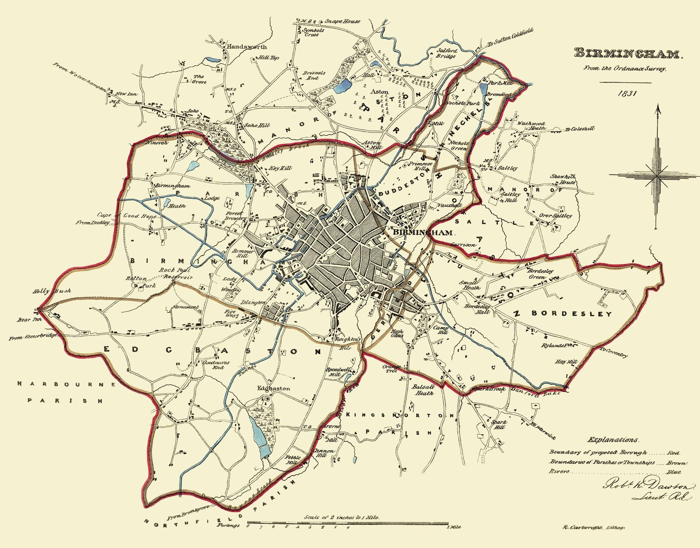

```{=html}
<div class="hero-section photo-hero hero-stretch">
  
  <div class="hero-text">
    <span class="hero-eyebrow">REPBIAS &middot; PID2021-128332NA-I00</span>
    <h1>The Sources of Representation Bias</h1>
    <p>Why elected representatives rarely mirror the electorate that put them there &mdash; and how one overlooked institution, malapportionment, shapes who gets heard.</p>
  </div>
  <div class="hero-credit">1831 Ordnance Survey map of the proposed Parliamentary Borough of Birmingham (Robert K. Dawson), surveyed for the boundary commission behind the 1832 Great Reform Act. Wikimedia Commons, public domain.</div>
  <div class="scroll-hint">&darr; scroll to explore</div>
</div>
```

:::::::::: project-body

## What is representation bias?

Modern parliaments are rarely a mirror of the societies that elect them. The preferences of policy-makers — and the policies they enact — are seldom fully congruent with those of the citizens they represent. Political science has traditionally explained this *representation bias* through three lenses: **who gets elected** (elite selection), **who turns out to vote** (electoral participation), and **the rules of the game** (electoral institutions).

REPBIAS focused on the third lens, and in particular on one institution that had received comparatively little attention despite its consequences: **malapportionment** — the mismatch between the share of seats and the share of votes (or population) allocated to each electoral district. When districts of very different sizes elect the same number of representatives, some votes simply count more than others.

## What the project did

*The sources of representation bias: An historical political economy approach* (REPBIAS, PID2021-128332NA-I00) ran from **September 2022 to July 2026**, led by [**Marc Guinjoan**](http://marcguinjoan.cat) (Universitat Autònoma de Barcelona) as Principal Investigator, and funded by the Spanish Ministry of Science and Innovation.

The project worked at two levels. First, at the **aggregate level**: how much does malapportionment actually distort representation, compared with district magnitude, seat-allocation formulas, or legal thresholds? Where does it come from historically, and have elites used it to entrench their own power? What role does it play in protecting or excluding ethnic and national minorities? Second, once these aggregate distortions were mapped out, the project moved to the **individual level**: how do citizens perceive and evaluate the electoral rules that shape their representation, and does the information they receive actually change how they vote?

## Main findings

::::::: insight-grid
::: {.insight-card .surface-card}
<span class="insight-icon">🗳️</span>

### District magnitude, not malapportionment, still rules

Across 65 democracies, district magnitude remains the single strongest institutional predictor of representation bias — ahead of malapportionment, the seat-allocation formula, or legal thresholds.
:::

::: {.insight-card .surface-card}
<span class="insight-icon">⚖️</span>

### Malapportionment isn't systematically right-biased

Contrary to the anecdotal case of Spain, malapportionment shows no consistent ideological direction in lower chambers worldwide — it favours the left as often as the right. Upper chambers are the exception, leaning right.
:::

::: {.insight-card .surface-card}
<span class="insight-icon">🏛️</span>

### Reforms tend to democratize, not entrench

Historically, electoral reforms have leaned more towards democratization than towards protecting incumbents — governments in consolidated democracies show little systematic ability to gerrymander malapportionment to their own advantage.
:::

::: {.insight-card .surface-card}
<span class="insight-icon">🌍</span>

### A tool for — and against — minorities

Malapportionment has long been used to protect the representation of ethnic and national minorities, and remains widely used for that purpose in states transitioning between democracy and autocracy.
:::

::: {.insight-card .surface-card}
<span class="insight-icon">🚩</span>

### Autocrats reform when threatened

In authoritarian regimes, electoral reforms are activated above all when rulers perceive a threat to their power — and the more ethnically diverse the country, the more likely those reforms take a territorial form.
:::

::: {.insight-card .surface-card}
<span class="insight-icon">📱</span>

### Information reinforces, it rarely converts

A large-scale Voting Advice Application experiment in Spain shows personalized political information strengthens voters' existing preferences, especially among the undecided — but does not trigger switching between parties.
:::
:::::::

## Explore by theme

::::: rl-grid
::: {.rl-card .surface-card}
<p><a href="origins.qmd"><strong>Origins of Institutions.</strong></a> Are electoral rules endogenous to the elites who design them? Two centuries of redistricting evidence, plus the caciquismo/VEARLYDEM historical line.</p>
:::

::: {.rl-card .surface-card}
<p><a href="malapportionment-bias.qmd"><strong>Malapportionment Bias.</strong></a> What MRB, SRB, ThRB and TRB mean, and how malapportionment distorts representation across 65 democracies — with an interactive map.</p>
:::

::: {.rl-card .surface-card}
<p><a href="minority-representation.qmd"><strong>Minority Representation.</strong></a> How malapportionment protects — or excludes — ethnic minorities across 84 countries, with an interactive map.</p>
:::

::: {.rl-card .surface-card}
<p><a href="decomposing-bias.qmd"><strong>Decomposing Bias.</strong></a> Try the REPBIAS simulation app yourself, isolating each institutional source of distortion.</p>
:::
:::::

Or browse the [full list of papers](papers.qmd), or [meet the team](team.qmd).

::::::::::
