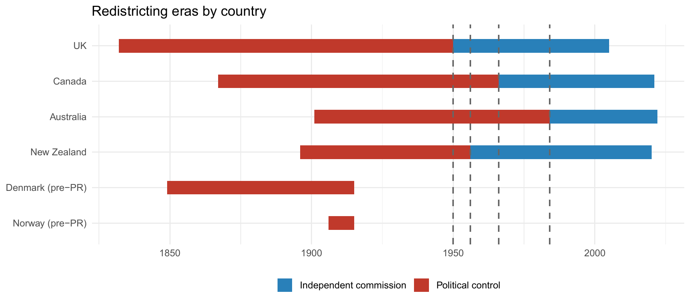

::: project-body

## Are electoral institutions endogenous to the elites who design them?

Electoral institutions are not handed down by nature — they are written, and redrawn, by the very political elites who compete under them. This raises an uncomfortable question for democratic theory: if incumbents control the rules of the game, do they bend those rules to protect their own advantage?

To answer this, REPBIAS built one of the largest historical district-level datasets ever assembled for this purpose: **more than 67,000 district-election observations across 14 countries, from 1832 to 2022** — tracking every documented boundary redistribution, and matching districts across successive reforms using large language models to link historical records that could never be reconciled by hand before.

A key design feature ran through the whole analysis: **who draws the map**. All four Commonwealth single-member-district countries moved, over the twentieth century, from redistricting under direct **political control** to **independent commissions** — a natural before/after comparison the project exploited throughout.

::: figure-card
{fig-alt="Timeline showing redistricting eras by country, coloured by whether boundaries were drawn under political control or by an independent commission, for the UK, Canada, Australia, New Zealand, Denmark and Norway, 1832–2022."}

Redistricting eras by country, 1832–2022. Red = political control, blue = independent commission. All four Commonwealth SMD countries eventually shifted to independent commissions (UK 1950, New Zealand 1956, Canada 1966, Australia 1984).

:::

Rather than asking a single question, the project broke the "do elites protect themselves?" problem into six testable pieces: does redistricting actually reduce malapportionment? Do reforms democratize the system or entrench their makers? Do governments *time* redistricting to protect their own seats? Are the seats that disappear disproportionately opposition-held? Does redistricting improve incumbents' over-representation? And, episode by episode, were the political intentions behind each reform actually realized?

::: figure-card
{fig-alt="Black and white portrait photograph of James Callaghan."}

James Callaghan, photographed in 1975. As Labour Home Secretary in 1969, Callaghan delayed implementing the Boundary Commission's recommended constituency changes — which would have disadvantaged Labour — until after the 1970 general election, a textbook case of the strategic-timing pattern this research line documents for the UK. Photo: Christian Lambiotte / European Communities, 1975 (CC BY 4.0), via Wikimedia Commons.

:::

## What we found

::::::: insight-grid
::: {.insight-card .surface-card}
⚖️

#### Redistricting equalizes

Malapportionment follows a clear "sawtooth" pattern: it drifts upward between redistributions as populations shift, then drops sharply when boundaries are redrawn. Redistricting does the equalizing job it is supposed to do.
:::

::: {.insight-card .surface-card}
🏛️

#### Reforms democratize, not entrench

Across 27 electoral-system reform episodes in 13 countries, malapportionment falls on average after a reform — and reformers gain no measurable advantage from it. A first "strategic fools" result: elites who change the rules mostly end up loosening their own grip, not tightening it.
:::

::: {.insight-card .surface-card}
⏳

#### The one thing elites do control: timing

Under political control, governments delay correcting their *own* over-represented seats longer than they delay correcting the opposition's. It was the one robust partisan fingerprint the research found — and it disappeared entirely once redistricting was handed to independent commissions.
:::

::: {.insight-card .surface-card}
🗺️

#### Abolition tracks demography, not partisanship

Seats that disappear in a redistricting lean slightly incumbent in both eras — but that is because over-represented (typically declining, rural) seats are disproportionately the government's, not because redistricting targets the opposition.
:::

::: {.insight-card .surface-card}
📊

#### No systematic distributional payoff

Even among seats that survive a redistricting, incumbents gain no measurable shift in over-representation toward their own side. Strategic timing (above) does not translate into strategic outcomes.
:::

::: {.insight-card .surface-card}
🔍

#### Named episodes: exceptions prove the rule

Looking at 29 individually named historical reforms (the UK's 1868 and 1885 Reform Acts, Canada's 1917 Electoral Districts Act, and others), most that deviate from neutrality ran *against* the government of the day — with Canada 1917, historiographically notorious as a partisan gerrymander, standing out as the clear exception that matches the historical record.
:::
:::::::

This is now a working paper — *"Historical Malapportionment and Elite Redistricting Strategies"* — coauthored by [Marc Guinjoan](http://marcguinjoan.cat), Carles Boix and Pablo Beramendi. See it on the [Papers](papers.qmd) page.

## A parallel historical line: caciquismo and electoral coordination

A companion historical line, developed together with the [VEARLYDEM](https://www.tonirodon.cat/ca/projectes/vearlydem/) project, asks a related but distinct question: not whether elites *design* institutions in their favour, but how the **legacy of historical clientelist control** — *caciquismo* during the Spanish Restoration — shaped voters' own capacity to coordinate their choices decades later, once competitive elections returned under the Second Republic. This paper — with Jaime Bordel, Toni Rodon, Pau Vall-Prat and Marc Guinjoan — will be featured on this page in more detail soon.

:::
