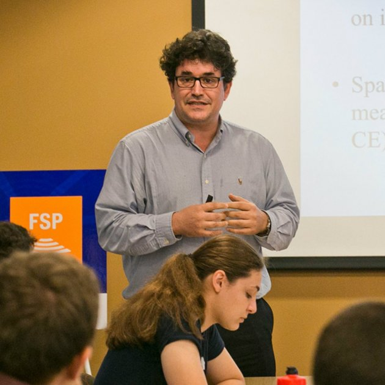

The REPBIAS project has a first-class multidisciplinary academic team with researchers from leading universities around the world.

## **Principal Investigator**

[**Marc Guinjoan**](http://marcguinjoan.cat) is the *Principal Investigator* of the project. Guinjoan is an Associate Professor at the Universitat Autònoma de Barcelona and previously was a research fellow at the Institutions and Political Economy Research Group (IPErG, Universitat de Barcelona), headed by Carles Boix. One of the main fields of interest of the PI is the study of electoral institutions. His thesis dissertation dealt with this topic and was published in 2014 by Routledge. He has also several journal articles on electoral institutions published in Government and Opposition, Public Opinion Quarterly and Social Science Quarterly, among others.

{fig-align="center" width="300"}

## **Research Team**

[**Carles Boix**](https://www.princeton.edu/~cboix/) is a Distinguished Professor at the IPErG (UB) and Robert Garrett professor at Princeton University. As director of the IPErG, Boix was the team leader in the Beramendi et al. (2021) project and has in-depth knowledge and publication record on the field of electoral institutions. In particular, Boix has largely worked on the endogenous origins of institutions (Boix 1999; Abramson and Boix 2019; Boix and Stokes 2003), as well as on historical political economy (Boix 2010; Amat et al. 2020; Basu et al. 2019; Boix and Rosenbluth 2014). Boix's publications have appeared in journals such as APSR (6 articles), AJPS (3), International Organization (2), CPS, the JoP, BJPS (2), World Politics (3); in addition, he has three books in Cambridge University Press and one book in Princeton University Press, among others.

{fig-align="center" width="300"}

[**Jordi Mas**](https://www.jordimas.cat/) obtained his PhD in 2016 and his research interests include political economy, international politics, regionalism, and methodology in social sciences. His work has been published in the JCMS. As an expert in R Statistics, Mas guides and supervises the methodological parts of the REPBIAS project that require the usage of extensive quantitative data.

{fig-align="center" width="300"}

## **Working Team**

[**Pablo Beramendi**](https://sites.duke.edu/beramendi/) is full professor at Duke University. His work focuses on different aspects of the political economy of inequality and redistribution, paying particular attention to the territorial dimension of distributive conflicts. Beramendi has articles published in CPS (4), IO, JoP (2), BJPS, WP, EJPR, Annual Review of Political Science, the Review of International Organizations (RIO), and 2 books in Cambridge University Press.

{fig-align="center" width="300"}

[**Melissa Rogers**](https://www.cgu.edu/people/melissa-rogers/) is associate professor at the Claremont Graduate University. She is a specialist in comparative politics, political geography, political economy, Latin American politics, and comparative political institutions. Her work has been published in the JoP (2), Political Analysis (2), RIO and she has one book in Cambridge University Press.

{fig-align="center" width="300"}

[**Toni Rodon**](https://tonirodon.cat/) is Associate Professor at Universitat Pompeu Fabra. His research interests include electoral participation, political geography, comparative politics and historical political economy. Rodon has extensively worked with data on the Second Republic (Rodon 2020; Muñoz et al. 2017; Amat et al. 2020) and contributes to the project's historical data work on electoral coordination and caciquismo. He has published in journals such as the APSR, JoP (2), BJPS, PSRM, Political Geography, JEPP and Socio-Economic Review.

{fig-align="center" width="350"}

[**Nikandros Ioannidis**](https://www.cut.ac.cy/) is a researcher at the Cyprus University of Technology, School of Communication and Media Studies. He joined the project through a collaboration on Voting Advice Applications (VAA), co-authoring "How Tailored Information Influences Election Dynamics" with the REPBIAS team.

## **PhD Student**

[**Jaime Bordel**](https://twitter.com/jaimebgl) is a PhD candidate (FPI fellow) at the Universitat Autònoma de Barcelona, supervised by Marc Guinjoan. He is the author of the book *"Salvini & Meloni. Hijos de la misma rabia"* and holds a Master in Social Sciences (Instituto Carlos III-Juan March). His doctoral thesis — on electoral reforms in authoritarian regimes and citizens' evaluations of electoral rules — comprises four papers, all developed within the REPBIAS project.

{fig-align="center" width="360"}

## **Research Assistants**

[**David Carbonell**](https://dcarboma.quarto.pub/dc/) is a political scientist (Universitat de Barcelona) and a data analyst, working on the project's simulation framework.

{fig-align="center" width="350"}

## **Former Team**

[**Xavier Roura**](https://twitter.com/XavierRoura) is a Political Scientist (Universitat Autònoma de Barcelona) and holds a Master in Institutions and Political Economy (Universitat de Barcelona). He was a Research Assistant on the project between 2023 and 2024.

{fig-align="center" width="350"}
